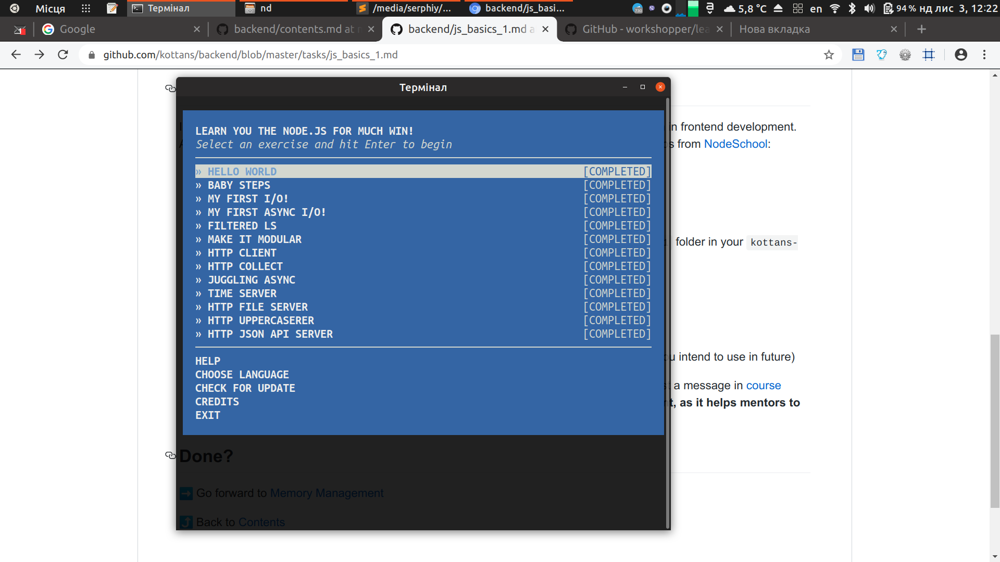
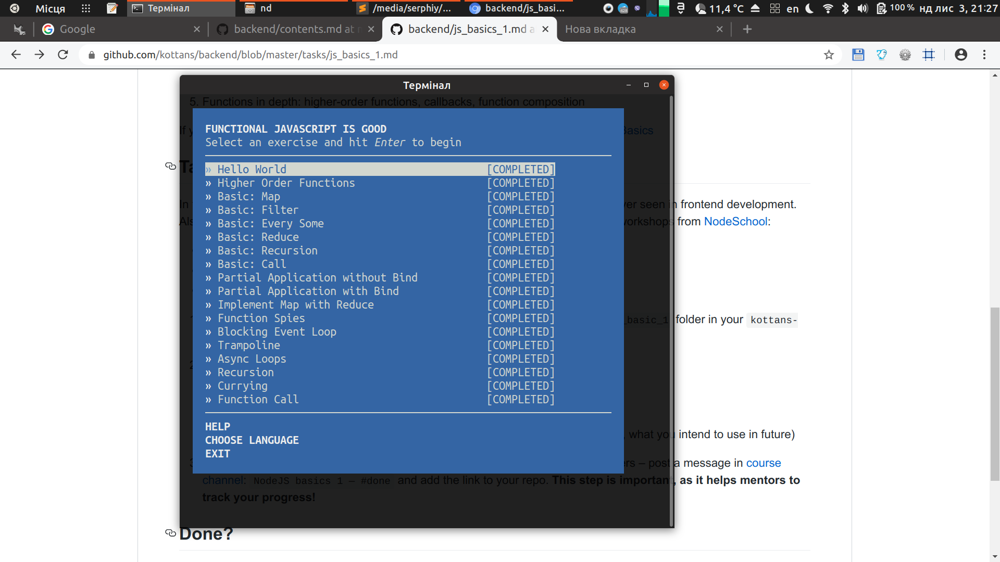
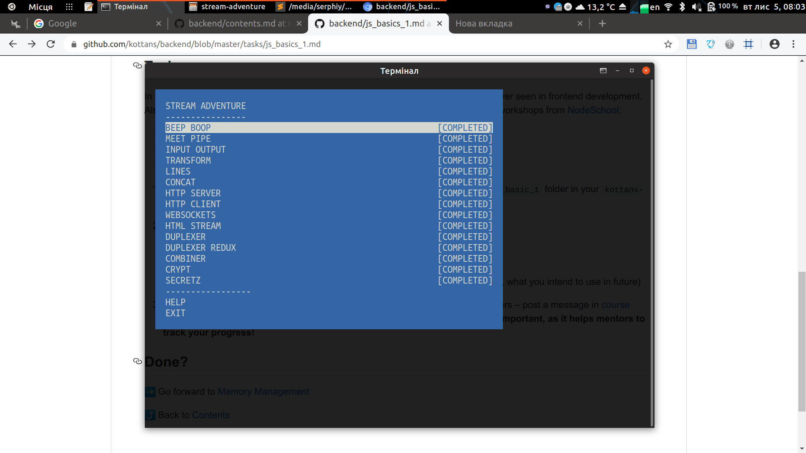

kottans-backend
===============

## Git Basics
It's always useful to revisit basic commands of git

## Unix Shell
[](task_unix_shell/linuxsurvival1.png)
[](task_unix_shell/linuxsurvival2.png)
[](task_unix_shell/linuxsurvival3.png)
[](task_unix_shell/linuxsurvival4.png)

I knew basic commands, but advanced topics contains new and useful ways to find information about system and manage processes.

## Git Collaboration
[](task_git_collaboration/github-collaboration.png)

I've never forked repositories before kottans course, now I know all github fork and pull request actions and I've learned `git rebase` command

## NodeJS Basics 1
[](node_basic_1/learnyounode.png)
[](node_basic_1/functional-js.png)
[](node_basic_1/stream-adventure.png)

I'm new to Node, so all Node-related tasks were unfamiliar; the trampoline and tricky connected streams were suprisingly challenging; definetly I/O is essential for any program.

## Memory Management
- What's going to happen if program reaches maximum limit of stack ?
    - There is  a stack overflow and the program receives a Segmentation Fault
- What's going to happen if program requests a big (more then 128KB) memory allocation on heap ?
    - Instead of using heap memory an anonymous memory mapping is created for the data (in the memory mapping segment)
- What's the difference between Text and Data memory segments ?
    - Text segment is read-only while the Data segment can be updated. The Text segment stores string literals and code; the data segment stores the contents for initialized static variables, but strings are stored in the Text segment with the pointers in the Data.

```bash
5648240d000-556482435000 r-xp 00000000 08:16 1468977                    /usr/bin/htop
556482635000-556482637000 r--p 00028000 08:16 1468977                    /usr/bin/htop
556482637000-55648263a000 rw-p 0002a000 08:16 1468977                    /usr/bin/htop
55648263a000-55648263b000 rw-p 00000000 00:00 0 
556483cf7000-556483e1b000 rw-p 00000000 00:00 0                          [heap]
7f113fe12000-7f113fe2c000 r-xp 00000000 08:16 923551                     /lib/x86_64-linux-gnu/libpthread-2.27.so
7f113fe2c000-7f114002b000 ---p 0001a000 08:16 923551                     /lib/x86_64-linux-gnu/libpthread-2.27.so
7f114002b000-7f114002c000 r--p 00019000 08:16 923551                     /lib/x86_64-linux-gnu/libpthread-2.27.so
7f114002c000-7f114002d000 rw-p 0001a000 08:16 923551                     /lib/x86_64-linux-gnu/libpthread-2.27.so
7f114002d000-7f1140031000 rw-p 00000000 00:00 0 
7f1140031000-7f1140038000 r-xp 00000000 08:16 923559                     /lib/x86_64-linux-gnu/librt-2.27.so
7f1140038000-7f1140237000 ---p 00007000 08:16 923559                     /lib/x86_64-linux-gnu/librt-2.27.so
7f1140237000-7f1140238000 r--p 00006000 08:16 923559                     /lib/x86_64-linux-gnu/librt-2.27.so
7f1140238000-7f1140239000 rw-p 00007000 08:16 923559                     /lib/x86_64-linux-gnu/librt-2.27.so
7f1140239000-7f1140275000 r-xp 00000000 08:16 917836                     /lib/x86_64-linux-gnu/libnss_systemd.so.2
7f1140275000-7f1140474000 ---p 0003c000 08:16 917836                     /lib/x86_64-linux-gnu/libnss_systemd.so.2
7f1140474000-7f1140477000 r--p 0003b000 08:16 917836                     /lib/x86_64-linux-gnu/libnss_systemd.so.2
7f1140477000-7f1140478000 rw-p 0003e000 08:16 917836                     /lib/x86_64-linux-gnu/libnss_systemd.so.2
7f1140478000-7f1140483000 r-xp 00000000 08:16 923508                     /lib/x86_64-linux-gnu/libnss_files-2.27.so
7f1140483000-7f1140682000 ---p 0000b000 08:16 923508                     /lib/x86_64-linux-gnu/libnss_files-2.27.so
7f1140682000-7f1140683000 r--p 0000a000 08:16 923508                     /lib/x86_64-linux-gnu/libnss_files-2.27.so
7f1140683000-7f1140684000 rw-p 0000b000 08:16 923508                     /lib/x86_64-linux-gnu/libnss_files-2.27.so
7f1140684000-7f114068a000 rw-p 00000000 00:00 0 
7f114068a000-7f11406a1000 r-xp 00000000 08:16 923502                     /lib/x86_64-linux-gnu/libnsl-2.27.so
7f11406a1000-7f11408a0000 ---p 00017000 08:16 923502                     /lib/x86_64-linux-gnu/libnsl-2.27.so
7f11408a0000-7f11408a1000 r--p 00016000 08:16 923502                     /lib/x86_64-linux-gnu/libnsl-2.27.so
7f11408a1000-7f11408a2000 rw-p 00017000 08:16 923502                     /lib/x86_64-linux-gnu/libnsl-2.27.so
7f11408a2000-7f11408a4000 rw-p 00000000 00:00 0 
7f11408a4000-7f11408af000 r-xp 00000000 08:16 923519                     /lib/x86_64-linux-gnu/libnss_nis-2.27.so
7f11408af000-7f1140aae000 ---p 0000b000 08:16 923519                     /lib/x86_64-linux-gnu/libnss_nis-2.27.so
7f1140aae000-7f1140aaf000 r--p 0000a000 08:16 923519                     /lib/x86_64-linux-gnu/libnss_nis-2.27.so
7f1140aaf000-7f1140ab0000 rw-p 0000b000 08:16 923519                     /lib/x86_64-linux-gnu/libnss_nis-2.27.so
7f1140ab0000-7f1140ab8000 r-xp 00000000 08:16 923504                     /lib/x86_64-linux-gnu/libnss_compat-2.27.so
7f1140ab8000-7f1140cb8000 ---p 00008000 08:16 923504                     /lib/x86_64-linux-gnu/libnss_compat-2.27.so
7f1140cb8000-7f1140cb9000 r--p 00008000 08:16 923504                     /lib/x86_64-linux-gnu/libnss_compat-2.27.so
7f1140cb9000-7f1140cba000 rw-p 00009000 08:16 923504                     /lib/x86_64-linux-gnu/libnss_compat-2.27.so
7f1140cba000-7f114131c000 r--p 00000000 08:16 1459806                    /usr/lib/locale/locale-archive
7f114131c000-7f114131f000 r-xp 00000000 08:16 923441                     /lib/x86_64-linux-gnu/libdl-2.27.so
7f114131f000-7f114151e000 ---p 00003000 08:16 923441                     /lib/x86_64-linux-gnu/libdl-2.27.so
7f114151e000-7f114151f000 r--p 00002000 08:16 923441                     /lib/x86_64-linux-gnu/libdl-2.27.so
7f114151f000-7f1141520000 rw-p 00003000 08:16 923441                     /lib/x86_64-linux-gnu/libdl-2.27.so
7f1141520000-7f1141707000 r-xp 00000000 08:16 923418                     /lib/x86_64-linux-gnu/libc-2.27.so
7f1141707000-7f1141907000 ---p 001e7000 08:16 923418                     /lib/x86_64-linux-gnu/libc-2.27.so
7f1141907000-7f114190b000 r--p 001e7000 08:16 923418                     /lib/x86_64-linux-gnu/libc-2.27.so
7f114190b000-7f114190d000 rw-p 001eb000 08:16 923418                     /lib/x86_64-linux-gnu/libc-2.27.so
7f114190d000-7f1141911000 rw-p 00000000 00:00 0 
7f1141911000-7f1141aae000 r-xp 00000000 08:16 923481                     /lib/x86_64-linux-gnu/libm-2.27.so
7f1141aae000-7f1141cad000 ---p 0019d000 08:16 923481                     /lib/x86_64-linux-gnu/libm-2.27.so
7f1141cad000-7f1141cae000 r--p 0019c000 08:16 923481                     /lib/x86_64-linux-gnu/libm-2.27.so
7f1141cae000-7f1141caf000 rw-p 0019d000 08:16 923481                     /lib/x86_64-linux-gnu/libm-2.27.so
7f1141caf000-7f1141cd4000 r-xp 00000000 08:16 923576                     /lib/x86_64-linux-gnu/libtinfo.so.5.9
7f1141cd4000-7f1141ed4000 ---p 00025000 08:16 923576                     /lib/x86_64-linux-gnu/libtinfo.so.5.9
7f1141ed4000-7f1141ed8000 r--p 00025000 08:16 923576                     /lib/x86_64-linux-gnu/libtinfo.so.5.9
7f1141ed8000-7f1141ed9000 rw-p 00029000 08:16 923576                     /lib/x86_64-linux-gnu/libtinfo.so.5.9
7f1141ed9000-7f1141f06000 r-xp 00000000 08:16 923493                     /lib/x86_64-linux-gnu/libncursesw.so.5.9
7f1141f06000-7f1142106000 ---p 0002d000 08:16 923493                     /lib/x86_64-linux-gnu/libncursesw.so.5.9
7f1142106000-7f1142107000 r--p 0002d000 08:16 923493                     /lib/x86_64-linux-gnu/libncursesw.so.5.9
7f1142107000-7f1142108000 rw-p 0002e000 08:16 923493                     /lib/x86_64-linux-gnu/libncursesw.so.5.9
7f1142108000-7f114212f000 r-xp 00000000 08:16 923390                     /lib/x86_64-linux-gnu/ld-2.27.so
7f11422f9000-7f11422fd000 rw-p 00000000 00:00 0 
7f1142328000-7f114232f000 r--s 00000000 08:16 136091                     /usr/lib/x86_64-linux-gnu/gconv/gconv-modules.cache
7f114232f000-7f1142330000 r--p 00027000 08:16 923390                     /lib/x86_64-linux-gnu/ld-2.27.so
7f1142330000-7f1142331000 rw-p 00028000 08:16 923390                     /lib/x86_64-linux-gnu/ld-2.27.so
7f1142331000-7f1142332000 rw-p 00000000 00:00 0 
7ffec0afe000-7ffec0b1f000 rw-p 00000000 00:00 0                          [stack]
7ffec0bb0000-7ffec0bb3000 r--p 00000000 00:00 0                          [vvar]
7ffec0bb3000-7ffec0bb5000 r-xp 00000000 00:00 0                          [vdso]
ffffffffff600000-ffffffffff601000 r-xp 00000000 00:00 0                  [vsyscall]   
```
Address examples:

- Heap - `556483cf7000-556483e1b000`
- Stack - `7ffec0afe000-7ffec0b1f000`
- MMS - `7f1140cb9000-7f1140cba000`

The structure of memory addresses was completly new to me, I was really surprised how easy a memory leak in JavaScript can be introduced. I'll use all given strategies and tools for avoiding and healing memory leaks.
