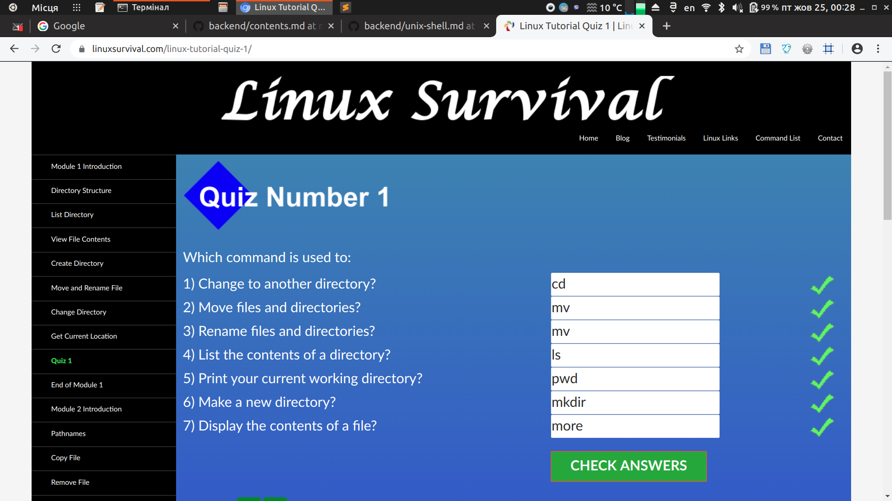

kottans-backend
===============

## Git Basics
It's always useful to revisit basic commands of git

## Unix Shell

I knew basic commands, but advanced topics contains new and useful ways to find information about system and manage processes.

## Git Collaboration

I've never forked repositories before kottans course, now I know all github fork and pull request actions and I've learned `git rebase` command

